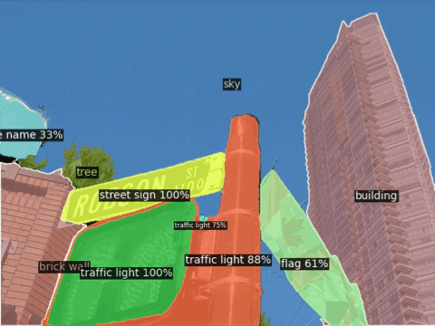
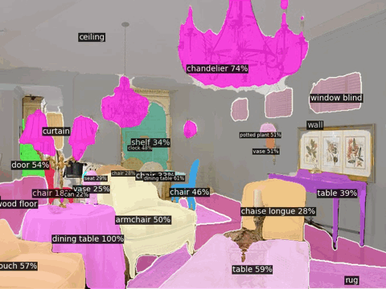
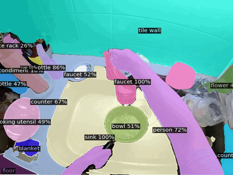
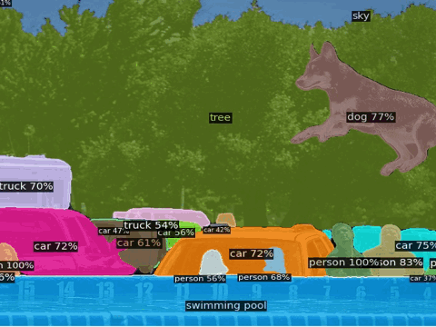
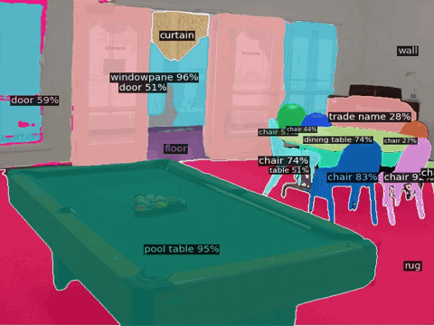
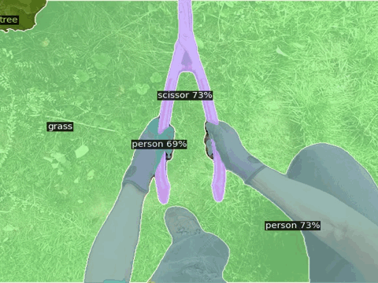

# ODISE: Open-Vocabulary Panoptic Segmentation with Text-to-Image Diffusion Models

**ODISE**: **O**pen-vocabulary **DI**ffusion-based panoptic **SE**gmentation exploits pre-trained text-image diffusion and discriminative models to perform open-vocabulary panoptic segmentation.
It leverages the frozen representation of both these models to perform panoptic segmentation of any category in the wild. 

This repository is the official implementation of ODISE introduced in the paper:

[**Open-Vocabulary Panoptic Segmentation with Text-to-Image Diffusion Models**](https://arxiv.org/abs/2303.04803)
[*Jiarui Xu*](https://jerryxu.net),
[*Sifei Liu**](https://research.nvidia.com/person/sifei-liu),
[*Arash Vahdat**](http://latentspace.cc/),
[*Wonmin Byeon*](https://wonmin-byeon.github.io/),
[*Xiaolong Wang*](https://xiaolonw.github.io/),
[*Shalini De Mello*](https://research.nvidia.com/person/shalini-de-mello)
CVPR 2023 Highlight. (*equal contribution)

For business inquiries, please visit our website and submit the form: [NVIDIA Research Licensing](https://www.nvidia.com/en-us/research/inquiries/).


## Visual Results

<div align="center">



</div>
<div align="center">



</div>


## Links
* [Jiarui Xu's Project Page](https://jerryxu.net/ODISE/) (with additional visual results)
* [HuggingFace 🤗 Demo](https://huggingface.co/spaces/xvjiarui/ODISE)
* [arXiv Page](https://arxiv.org/abs/2303.04803)

## Citation

If you find our work useful in your research, please cite:

```BiBTeX
@article{xu2022odise,
  author    = {Xu, Jiarui and Liu, Sifei and Vahdat, Arash and Byeon, Wonmin and Wang, Xiaolong and De Mello, Shalini},
  title     = {{ODISE: Open-Vocabulary Panoptic Segmentation with Text-to-Image Diffusion Models}},
  journal   = {arXiv preprint arXiv: 2303.04803},
  year      = {2023},
}
```

## Environment Setup

Install dependencies by running:

```bash
conda create -n odise python=3.9
conda activate odise
conda install pytorch=1.13.1 torchvision=0.14.1 pytorch-cuda=11.6 -c pytorch -c nvidia
conda install -c "nvidia/label/cuda-11.6.1" libcusolver-dev
git clone git@github.com:NVlabs/ODISE.git 
cd ODISE
pip install -e .
```

(Optional) install [xformers](https://github.com/facebookresearch/xformers) for efficient transformer implementation:
One could either install the pre-built version

```
pip install xformers==0.0.16
```

or build from latest source 

```bash
# (Optional) Makes the build much faster
pip install ninja
# Set TORCH_CUDA_ARCH_LIST if running and building on different GPU types
pip install -v -U git+https://github.com/facebookresearch/xformers.git@main#egg=xformers
# (this can take dozens of minutes)
```

## Model Zoo

We provide two pre-trained models for ODISE trained with label or caption 
supervision on [COCO's](https://cocodataset.org/#home) entire training set.
ODISE's pre-trained models are subject to the [Creative Commons — Attribution-NonCommercial-ShareAlike 4.0 International — CC BY-NC-SA 4.0 License](https://creativecommons.org/licenses/by-nc-sa/4.0/legalcode) terms.
Each model contains 28.1M trainable parameters.
The download links for these models are provided in the table below.
When you run the `demo/demo.py` script for the very first time, it will also automatically download ODISE's pre-trained model to your local folder `$HOME/.torch/iopath_cache/NVlabs/ODISE/releases/download/v1.0.0/`.

<table>
<thead>
  <tr>
    <th align="center"></th>
    <th align="center" style="text-align:center" colspan="3">ADE20K(A-150)</th>
    <th align="center" style="text-align:center" colspan="3">COCO</th>
    <th align="center" style="text-align:center">ADE20K-Full <br> (A-847)</th>
    <th align="center" style="text-align:center">Pascal Context 59 <br> (PC-59)</th>
    <th align="center" style="text-align:center">Pascal Context 459 <br> (PC-459)</th>
    <th align="center" style="text-align:center">Pascal VOC 21 <br> (PAS-21) </th>
    <th align="center" style="text-align:center">download </th>
  </tr>
</thead>
<tbody>
  <tr>
    <td align="center"></td>
    <td align="center">PQ</td>
    <td align="center">mAP</td>
    <td align="center">mIoU</td>
    <td align="center">PQ</td>
    <td align="center">mAP</td>
    <td align="center">mIoU</td>
    <td align="center">mIoU</td>
    <td align="center">mIoU</td>
    <td align="center">mIoU</td>
    <td align="center">mIoU</td>
  </tr>
  <tr>
    <td align="center"><a href="configs/Panoptic/odise_label_coco_50e.py"> ODISE (label) </a></td>
    <td align="center">22.6</td>
    <td align="center">14.4</td>
    <td align="center">29.9</td>
    <td align="center">55.4</td>
    <td align="center">46.0</td>
    <td align="center">65.2</td>
    <td align="center">11.1</td>
    <td align="center">57.3</td>
    <td align="center">14.5</td>
    <td align="center">84.6</td>
    <td align="center"><a href="https://github.com/NVlabs/ODISE/releases/download/v1.0.0/odise_label_coco_50e-b67d2efc.pth"> checkpoint </a></td>
  </tr>
  <tr>
    <td align="center"><a href="configs/Panoptic/odise_caption_coco_50e.py"> ODISE (caption) </a></td>
    <td align="center">23.4</td>
    <td align="center">13.9</td>
    <td align="center">28.7</td>
    <td align="center">45.6</td>
    <td align="center">38.4</td>
    <td align="center">52.4</td>
    <td align="center">11.0</td>
    <td align="center">55.3</td>
    <td align="center">13.8</td>
    <td align="center">82.7</td>
    <td align="center"><a href="https://github.com/NVlabs/ODISE/releases/download/v1.0.0/odise_caption_coco_50e-853cc971.pth"> checkpoint </a></td>
  </tr>
</tbody>
</table>

## Get Started
See [Preparing Datasets for ODISE](datasets/README.md).

See [Getting Started with ODISE](GETTING_STARTED.md) for detailed instuctions on training and inference with ODISE.
## Demo

* Integrated into [Huggingface Spaces 🤗](https://huggingface.co/spaces) using [Gradio](https://github.com/gradio-app/gradio). Try out the web demo: [](https://huggingface.co/spaces/xvjiarui/ODISE)

* Run the demo on Google Colab: [](https://colab.research.google.com/github/NVlabs/ODISE/blob/master/demo/demo.ipynb)


**Important Note**: When you run the `demo/demo.py` script for the very first time, besides ODISE's pre-trained models, it will also automaticlaly download the pre-trained models for [Stable Diffusion v1.3](https://huggingface.co/CompVis/stable-diffusion-v-1-3-original/resolve/main/sd-v1-3.ckpt) and [CLIP](https://openaipublic.azureedge.net/clip/models/3035c92b350959924f9f00213499208652fc7ea050643e8b385c2dac08641f02/ViT-L-14-336px.pt), from their original sources, to your local directories `$HOME/.torch/` and `$HOME/.cache/clip`, respectively.
The pre-trained models for Stable Diffusion and CLIP are subject to their original licencse terms from [Stable Diffusion](https://github.com/CompVis/stable-diffusion) and [CLIP](https://github.com/openai/CLIP), respectively.

* To run ODISE's demo from the command line:

    ```shell
    python demo/demo.py --input demo/examples/coco.jpg --output demo/coco_pred.jpg --vocab "black pickup truck, pickup truck; blue sky, sky"
    ```
    The output is saved in `demo/coco_pred.jpg`. For more detailed options for `demo/demo.py` see [Getting Started with ODISE](GETTING_STARTED.md).
    
  
* To run the [Gradio](https://github.com/gradio-app/gradio) demo locally:
    ```shell
    python demo/app.py
    ```

## Acknowledgement

Code is largely based on [Detectron2](https://github.com/facebookresearch/detectron2), [Stable Diffusion](https://github.com/CompVis/stable-diffusion), [Mask2Former](https://github.com/facebookresearch/Mask2Former), [OpenCLIP](https://github.com/mlfoundations/open_clip) and [GLIDE](https://github.com/openai/glide-text2im).

Thank you, all, for the great open-source projects!
